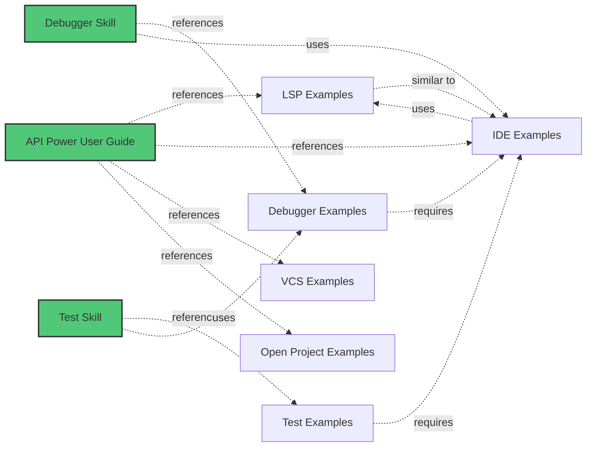
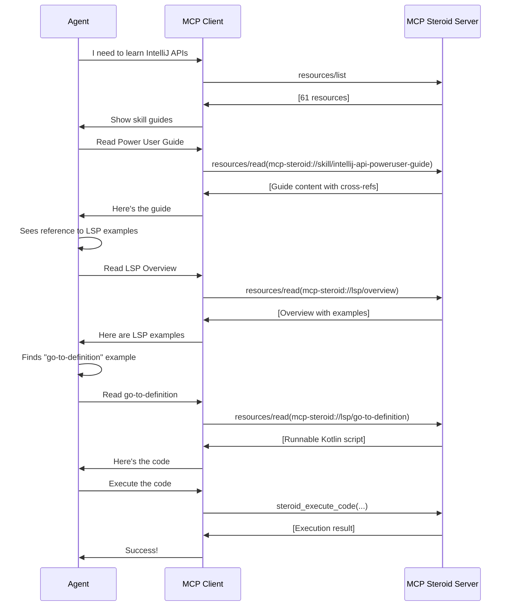

# IntelliJ MCP Steroid - Complete Resource Graph

This document provides a complete map of all MCP resources available in the IntelliJ MCP Steroid server, showing their relationships and recommended navigation paths.

## Connect to the MCP Server

1. Open IntelliJ IDEA with the MCP Steroid plugin installed (the server starts automatically).
2. Read `.idea/mcp-steroid.md` in your project folder for the full MCP URL.
3. Use that URL in your MCP client (it already ends with `/mcp`).

Notes:
- Host and port are configurable via `mcp.steroid.server.host` and `mcp.steroid.server.port`.
- Discovery is available at `/.well-known/mcp.json`.

## Resource Overview

The MCP Steroid server provides **61 resources** organized into 8 categories:

- **3 Skill Guides** - Core documentation for mastering IntelliJ APIs
- **11 LSP Examples** - Language Server Protocol-like operations
- **22 IDE Examples** - Advanced IDE operations and refactorings
- **7 Debugger Examples** - Debug session management and inspection
- **10 Test Examples** - Test execution and result inspection
- **3 VCS Examples** - Version control operations
- **4 Open Project Examples** - Project opening workflows
- **1 Documentation** - Complete resource graph and navigation guide

## Resource Hierarchy

```mermaid
graph TD
    ROOT[MCP Steroid Server]

    ROOT --> SKILL[Skill Guides]
    ROOT --> LSP[LSP Examples]
    ROOT --> IDE[IDE Examples]
    ROOT --> DEBUG[Debugger Examples]
    ROOT --> TEST[Test Examples]
    ROOT --> VCS[VCS Examples]
    ROOT --> OPEN[Open Project Examples]

    SKILL --> SKILL1[IntelliJ API Power User Guide]
    SKILL --> SKILL2[Debugger Skill Guide]
    SKILL --> SKILL3[Test Runner Skill Guide]

    LSP --> LSP_OV[LSP Overview]
    LSP_OV --> LSP1[Go to Definition]
    LSP_OV --> LSP2[Find References]
    LSP_OV --> LSP3[Hover Information]
    LSP_OV --> LSP4[Code Completion]
    LSP_OV --> LSP5[Document Symbols]
    LSP_OV --> LSP6[Rename Symbol]
    LSP_OV --> LSP7[Format Document]
    LSP_OV --> LSP8[Code Actions/Quick Fixes]
    LSP_OV --> LSP9[Signature Help]
    LSP_OV --> LSP10[Workspace Symbol Search]

    IDE --> IDE_OV[IDE Overview]
    IDE_OV --> IDE1[Extract Method]
    IDE_OV --> IDE2[Introduce Variable]
    IDE_OV --> IDE3[Inline Method]
    IDE_OV --> IDE4[Change Signature]
    IDE_OV --> IDE5[Move File]
    IDE_OV --> IDE6[Safe Delete]
    IDE_OV --> IDE7[Optimize Imports]
    IDE_OV --> IDE8[Generate Override]
    IDE_OV --> IDE9[Inspect and Fix]
    IDE_OV --> IDE10[Hierarchy Search]
    IDE_OV --> IDE11[Call Hierarchy]
    IDE_OV --> IDE12[Run Configuration]
    IDE_OV --> IDE13[Pull Up Members]
    IDE_OV --> IDE14[Push Down Members]
    IDE_OV --> IDE15[Extract Interface]
    IDE_OV --> IDE16[Move Class]
    IDE_OV --> IDE17[Generate Constructor]
    IDE_OV --> IDE18[Project Dependencies]
    IDE_OV --> IDE19[Inspection Summary]
    IDE_OV --> IDE20[Project Search]
    IDE_OV --> IDE21[Demo Debug Test]

    DEBUG --> DEBUG_OV[Debugger Overview]
    DEBUG_OV --> DEBUG1[Set Line Breakpoint]
    DEBUG_OV --> DEBUG2[Debug Run Configuration]
    DEBUG_OV --> DEBUG3[Debug Session Control]
    DEBUG_OV --> DEBUG4[List Debug Threads]
    DEBUG_OV --> DEBUG5[Build Thread Dump]
    DEBUG_OV --> DEBUG6[Demo Debug Test]

    TEST --> TEST_OV[Test Overview]
    TEST_OV --> TEST1[List Run Configurations]
    TEST_OV --> TEST2[Run Tests]
    TEST_OV --> TEST3[Wait for Completion]
    TEST_OV --> TEST4[Inspect Test Results]
    TEST_OV --> TEST5[Test Tree Navigation]
    TEST_OV --> TEST6[Test Statistics]
    TEST_OV --> TEST7[Test Failure Details]
    TEST_OV --> TEST8[Find Recent Test Run]
    TEST_OV --> TEST9[Demo Debug Test]

    VCS --> VCS_OV[VCS Overview]
    VCS_OV --> VCS1[Git Annotations/Blame]
    VCS_OV --> VCS2[Git File History]

    OPEN --> OPEN_OV[Open Project Overview]
    OPEN_OV --> OPEN1[Open Project Trusted]
    OPEN_OV --> OPEN2[Open Project with Dialogs]
    OPEN_OV --> OPEN3[Open Project via Code]

    style ROOT fill:#4a90e2,stroke:#333,stroke-width:4px,color:#fff
    style SKILL fill:#50c878,stroke:#333,stroke-width:2px
    style LSP fill:#f39c12,stroke:#333,stroke-width:2px
    style IDE fill:#e74c3c,stroke:#333,stroke-width:2px
    style DEBUG fill:#9b59b6,stroke:#333,stroke-width:2px
    style TEST fill:#1abc9c,stroke:#333,stroke-width:2px
    style VCS fill:#34495e,stroke:#333,stroke-width:2px
    style OPEN fill:#3498db,stroke:#333,stroke-width:2px
```



## Resource URI Reference

### Skill Guides
| Resource | URI |
|----------|-----|
| IntelliJ API Power User Guide | `mcp-steroid://skill/intellij-api-poweruser-guide` |
| Debugger Skill Guide | `mcp-steroid://skill/debugger-guide` |
| Test Runner Skill Guide | `mcp-steroid://skill/test-runner-guide` |

### LSP Examples
| Resource | URI |
|----------|-----|
| LSP Overview | `mcp-steroid://lsp/overview` |
| Go to Definition | `mcp-steroid://lsp/go-to-definition` |
| Find References | `mcp-steroid://lsp/find-references` |
| Hover Information | `mcp-steroid://lsp/hover` |
| Code Completion | `mcp-steroid://lsp/completion` |
| Document Symbols | `mcp-steroid://lsp/document-symbols` |
| Rename Symbol | `mcp-steroid://lsp/rename` |
| Format Document | `mcp-steroid://lsp/formatting` |
| Code Actions/Quick Fixes | `mcp-steroid://lsp/code-action` |
| Signature Help | `mcp-steroid://lsp/signature-help` |
| Workspace Symbol Search | `mcp-steroid://lsp/workspace-symbol` |

### IDE Examples
| Resource | URI |
|----------|-----|
| IDE Overview | `mcp-steroid://ide/overview` |
| Extract Method | `mcp-steroid://ide/extract-method` |
| Introduce Variable | `mcp-steroid://ide/introduce-variable` |
| Inline Method | `mcp-steroid://ide/inline-method` |
| Change Signature | `mcp-steroid://ide/change-signature` |
| Move File | `mcp-steroid://ide/move-file` |
| Safe Delete | `mcp-steroid://ide/safe-delete` |
| Optimize Imports | `mcp-steroid://ide/optimize-imports` |
| Generate Override | `mcp-steroid://ide/generate-override` |
| Inspect and Fix | `mcp-steroid://ide/inspect-and-fix` |
| Hierarchy Search | `mcp-steroid://ide/hierarchy-search` |
| Call Hierarchy | `mcp-steroid://ide/call-hierarchy` |
| Run Configuration | `mcp-steroid://ide/run-configuration` |
| Pull Up Members | `mcp-steroid://ide/pull-up-members` |
| Push Down Members | `mcp-steroid://ide/push-down-members` |
| Extract Interface | `mcp-steroid://ide/extract-interface` |
| Move Class | `mcp-steroid://ide/move-class` |
| Generate Constructor | `mcp-steroid://ide/generate-constructor` |
| Project Dependencies | `mcp-steroid://ide/project-dependencies` |
| Inspection Summary | `mcp-steroid://ide/inspection-summary` |
| Project Search | `mcp-steroid://ide/project-search` |
| Demo Debug Test | `mcp-steroid://ide/demo-debug-test` |

### Debugger Examples
| Resource | URI |
|----------|-----|
| Debugger Overview | `mcp-steroid://debugger/overview` |
| Set Line Breakpoint | `mcp-steroid://debugger/set-line-breakpoint` |
| Debug Run Configuration | `mcp-steroid://debugger/debug-run-configuration` |
| Demo Debug Test | `mcp-steroid://debugger/demo-debug-test` |
| Debug Session Control | `mcp-steroid://debugger/debug-session-control` |
| List Debug Threads | `mcp-steroid://debugger/debug-list-threads` |
| Build Thread Dump | `mcp-steroid://debugger/debug-thread-dump` |

### Test Examples
| Resource | URI |
|----------|-----|
| Test Overview | `mcp-steroid://test/overview` |
| List Run Configurations | `mcp-steroid://test/list-run-configurations` |
| Run Tests | `mcp-steroid://test/run-tests` |
| Wait for Completion | `mcp-steroid://test/wait-for-completion` |
| Inspect Test Results | `mcp-steroid://test/inspect-test-results` |
| Test Tree Navigation | `mcp-steroid://test/test-tree-navigation` |
| Test Statistics | `mcp-steroid://test/test-statistics` |
| Test Failure Details | `mcp-steroid://test/test-failure-details` |
| Find Recent Test Run | `mcp-steroid://test/find-recent-test-run` |
| Demo Debug Test | `mcp-steroid://test/demo-debug-test` |

### VCS Examples
| Resource | URI |
|----------|-----|
| VCS Overview | `mcp-steroid://vcs/overview` |
| Git Annotations (Blame) | `mcp-steroid://vcs/git-annotations` |
| Git File History | `mcp-steroid://vcs/git-history` |

### Open Project Examples
| Resource | URI |
|----------|-----|
| Open Project Overview | `mcp-steroid://open-project/overview` |
| Open Project (Trusted) | `mcp-steroid://open-project/open-trusted` |
| Open Project (With Dialogs) | `mcp-steroid://open-project/open-with-dialogs` |
| Open Project (Via Code) | `mcp-steroid://open-project/open-via-code` |

## Common Navigation Paths

### For Beginners
1. Start with `mcp-steroid://skill/intellij-api-poweruser-guide` - Learn the basics
2. Explore `mcp-steroid://lsp/overview` - Understand LSP-like operations
3. Try `mcp-steroid://ide/overview` - See advanced IDE features

### For Code Analysis
1. `mcp-steroid://skill/intellij-api-poweruser-guide` - PSI navigation patterns
2. `mcp-steroid://lsp/go-to-definition` - Navigate to symbol definitions
3. `mcp-steroid://lsp/find-references` - Find all usages
4. `mcp-steroid://lsp/hover` - Get documentation and type info
5. `mcp-steroid://ide/hierarchy-search` - Find class hierarchies

### For Refactoring
1. `mcp-steroid://skill/intellij-api-poweruser-guide` - Refactoring best practices
2. `mcp-steroid://lsp/rename` - Rename symbols
3. `mcp-steroid://ide/extract-method` - Extract methods
4. `mcp-steroid://ide/inline-method` - Inline methods
5. `mcp-steroid://ide/change-signature` - Change method signatures
6. `mcp-steroid://ide/move-class` - Move classes between packages

### For Debugging
1. `mcp-steroid://skill/debugger-guide` - Debugger workflow overview
2. `mcp-steroid://debugger/overview` - Debugger examples overview
3. `mcp-steroid://debugger/set-line-breakpoint` - Set breakpoints
4. `mcp-steroid://debugger/debug-run-configuration` - Start debug session
5. `mcp-steroid://debugger/debug-list-threads` - Inspect threads
6. `mcp-steroid://debugger/debug-thread-dump` - Build thread dump

### For Testing
1. `mcp-steroid://skill/test-runner-guide` - Test execution patterns
2. `mcp-steroid://test/overview` - Test examples overview
3. `mcp-steroid://test/list-run-configurations` - List test configs
4. `mcp-steroid://test/run-tests` - Run tests
5. `mcp-steroid://test/inspect-test-results` - Check results
6. `mcp-steroid://test/test-failure-details` - Analyze failures

### For Version Control
1. `mcp-steroid://skill/intellij-api-poweruser-guide` - VCS API basics
2. `mcp-steroid://vcs/overview` - VCS examples overview
3. `mcp-steroid://vcs/git-annotations` - Get git blame
4. `mcp-steroid://vcs/git-history` - View commit history

### For Project Management
1. `mcp-steroid://skill/intellij-api-poweruser-guide` - Project model basics
2. `mcp-steroid://open-project/overview` - Project opening overview
3. `mcp-steroid://open-project/open-trusted` - Quick project opening
4. `mcp-steroid://ide/project-dependencies` - View dependencies
5. `mcp-steroid://ide/project-search` - Search project files

## Cross-Category Relationships



## Resource Discovery Workflow



## Usage Examples

### Discovering Resources
```javascript
// List all resources
const resources = await client.callTool({
  name: "resources/list"
});

// Resources are organized by URI pattern
resources.filter(r => r.uri.startsWith("mcp-steroid://skill/"))      // Skill guides
resources.filter(r => r.uri.startsWith("mcp-steroid://lsp/"))        // LSP examples
resources.filter(r => r.uri.startsWith("mcp-steroid://ide/"))        // IDE examples
resources.filter(r => r.uri.startsWith("mcp-steroid://debugger/"))   // Debugger examples
resources.filter(r => r.uri.startsWith("mcp-steroid://test/"))       // Test examples
resources.filter(r => r.uri.startsWith("mcp-steroid://vcs/"))        // VCS examples
resources.filter(r => r.uri.startsWith("mcp-steroid://open-project/")) // Open project
```

### Reading a Resource
```javascript
// Read the Power User Guide
const guide = await client.callTool({
  name: "resources/read",
  arguments: {
    uri: "mcp-steroid://skill/intellij-api-poweruser-guide"
  }
});

console.log(guide.contents[0].text); // Full guide content with cross-refs
```

### Following Cross-References
```javascript
// Resource content includes cross-references like:
// [LSP Examples](mcp-steroid://lsp/overview)

// Extract URI and follow
const lspOverview = await client.callTool({
  name: "resources/read",
  arguments: {
    uri: "mcp-steroid://lsp/overview"
  }
});

// LSP Overview links to specific examples:
// [Go to Definition](mcp-steroid://lsp/go-to-definition)

// Read the example
const example = await client.callTool({
  name: "resources/read",
  arguments: {
    uri: "mcp-steroid://lsp/go-to-definition"
  }
});

// Execute the example code
const result = await client.callTool({
  name: "steroid_execute_code",
  arguments: {
    project_name: "my-project",
    code: example.contents[0].text, // The .kts file content
    task_id: "explore-lsp",
    reason: "Testing go-to-definition example"
  }
});
```

## Resource Metadata

All resources include:
- **uri**: Unique identifier (e.g., `mcp-steroid://skill/intellij-api-poweruser-guide`)
- **name**: Human-readable name
- **description**: Brief description of the resource
- **mimeType**: Content type (`text/markdown` or `text/x-kotlin`)

## Best Practices

1. **Start with Skill Guides** - They provide foundational knowledge
2. **Use Overview Resources** - They give a complete picture of each category
3. **Follow Cross-References** - Navigate naturally through related topics
4. **Run Example Code** - Examples are runnable scripts you can execute
5. **Provide Feedback** - Use `steroid_execute_feedback` to track success
6. **Explore Systematically** - Use the navigation paths above

## Summary

The MCP Steroid resource system provides:
- **Comprehensive Documentation** - 61 resources covering all aspects
- **Logical Organization** - 8 categories with clear hierarchy
- **Rich Cross-References** - Every resource links to related content
- **Runnable Examples** - All examples are ready to execute
- **Progressive Learning** - Clear paths from beginner to advanced

**Start exploring**: `mcp-steroid://skill/intellij-api-poweruser-guide`
